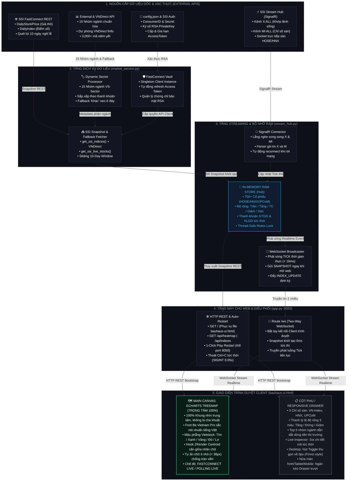

# SƠ ĐỒ KIẾN TRÚC HỆ THỐNG HEATMAP STOCKS
*(Vietnamese Stock Realtime Heatmap Architecture • SSI FastConnect & ECharts Engine)*

---

## 1. SƠ ĐỒ DÒNG DỮ LIỆU & KIẾN TRÚC TỔNG THỂ (MERMAID FLOWCHART)

Sơ đồ thể hiện luồng dữ liệu 5 tầng từ nguồn cấp sàn chứng khoán, qua tầng xử lý Python Backend, lưu trữ RAM Store và phân phối thời gian thực tới giao diện người dùng:



---

## 2. HƯỚNG DẪN XUẤT SƠ ĐỒ QUA CÁC CÔNG CỤ MERMAID

Bạn có thể sử dụng file [`diagram.mmd`](file:///Users/huydang/Machine%20Learning/Heatmap%20Stocks/diagram.mmd) để xuất ra file hình ảnh:

### Cách 1: Xuất trực tuyến qua Mermaid Live Editor (Khuyên dùng - Nhanh nhất)
1. Truy cập: **[https://mermaid.live](https://mermaid.live)**
2. Mở file [`diagram.mmd`](file:///Users/huydang/Machine%20Learning/Heatmap%20Stocks/diagram.mmd), sao chép toàn bộ nội dung và dán vào khung soạn thảo bên trái.
3. Nhấn nút **Actions** → Chọn định dạng xuất:
   - **Download PNG** (Độ phân giải cao)
   - **Download SVG** (Đồ họa vector sắc nét không vỡ hạt)
   - **Copy Markdown** / **Copy Image URL**

### Cách 2: Xem trực tiếp trong IDE (VS Code / Cursor / Antigravity)
- Nhấn phím `Cmd + Shift + V` trên file `DIAGRAM.md` để mở chế độ xem trước (Markdown Preview). Sơ đồ sẽ được tự động vẽ dưới dạng đồ họa vector tương tác.

### Cách 3: Xuất tự động bằng Mermaid CLI (Dòng lệnh terminal)
```bash
# Xuất ảnh PNG độ nét cao:
mmdc -i diagram.mmd -o diagram.png -b transparent -w 2400

# Xuất ảnh vector SVG chuẩn in ấn:
mmdc -i diagram.mmd -o diagram.svg
python3 clean_svg.py diagram.svg
```

---

## 3. BẢNG ĐỐI SOÁT: SƠ ĐỒ CŨ VS THỰC TẾ DỰ ÁN HIỆN TẠI

| Thành phần | Sơ đồ cũ (Trước đây) | Thực tế dự án hiện tại (Đã chuẩn hóa 100%) | Tình trạng khớp |
| :--- | :--- | :--- | :---: |
| **Trọng tâm giao diện** | ECharts bị kẹp cứng cạnh bảng mã table; co màn hình bị mất ECharts | **ECharts là TRỌNG TÂM 100%**. Chiếm toàn bộ không gian trung tâm trên mọi kích cỡ màn hình. | ✅ 100% Chuẩn xác |
| **Cột bên trái** | Chứa 'Bảng giá danh sách mã (Sort theo GTGD)' dài cồng kềnh | **Loại bỏ bảng table thô**. Thay bằng: **Thanh độ rộng thị trường**, **Top 6 dòng tiền ngành**, và **Live Inspector**. | ✅ 100% Chuẩn xác |
| **Responsive (Nửa màn hình, Tablet, Mobile)** | Bị lỗi xếp chồng dọc (`flex-direction: column`), cột trái chiếm 100vh đẩy ECharts biến mất khỏi màn hình | **Chuyển thành Drawer (Ngăn kéo trượt)** trên màn hình ≤ 1024px. Mặc định ẩn nhường 100% cho ECharts, bấm `[ 📊 Bảng chỉ số ]` trượt ra êm ái. | ✅ 100% Chuẩn xác |
| **Cơ chế 100% Fullscreen Heatmap** | Nút bấm bị lỗi do thiếu dấu phẩy trong JS | **Nút `[ ◀ Bảng chỉ số ]`** thu gọn cột trái về 0px, ECharts tự bung nở 100% không viền (chuẩn Finviz). | ✅ 100% Chuẩn xác |
| **Font chữ & Màu sắc** | Font mặc định, bộ màu neon chói mắt | **Font Be Vietnam Pro** chuẩn tiếng Việt; **Bộ màu phẳng nguyên bản Vietstock & SSI** (`#00c073`, `#ef4444`, `#facc15`, `#a855f7`, `#06b6d4`). | ✅ 100% Chuẩn xác |
| **Chế độ đường truyền & Failover** | Chưa mô tả cơ chế dự phòng | **Hiển thị rõ 2 trạng thái: FASTCONNECT LIVE (WebSocket) và POLLING LIVE (HTTP fallback 2.5s)**. | ✅ 100% Chuẩn xác |
| **Quản lý Server & Socket** | Phải gõ lệnh kill thủ công; bấm Ctrl+C dễ bị treo terminal | **1-Click Play Restart**: Tự giải phóng cổng 8050 khi bấm Run; **Thoát Ctrl+C tức thời (SIGINT 0.05s)**. | ✅ 100% Chuẩn xác |
| **Phân loại ngành nghề** | 13 ngành thô | **15 nhóm ngành chuẩn SSI / Vietstock (VS-Sector)** với nhóm 'Khác' được neo an toàn ở đáy. | ✅ 100% Chuẩn xác |
| **Nguồn dữ liệu chỉ số** | Chỉ phụ thuộc SSI FastConnect | Tích hợp **VNDirect finfo fallback** và trích xuất chỉ số sống đảm bảo không bao giờ rỗng số liệu. | ✅ 100% Chuẩn xác |
| **Quy mô quản lý mã CP** | 469+ cổ phiếu | Quản lý thời gian thực toàn bộ **700+ mã niêm yết** trên cả 3 sàn HOSE, HNX và UPCoM. | ✅ 100% Chuẩn xác |

---

## 4. TỆP POSTER ĐỒ HỌA A4 (300 DPI) CÓ SẴN TRONG DỰ ÁN

Hệ thống cũng duy trì script Python [`Diagram_Workflow.py`](file:///Users/huydang/Machine%20Learning/Heatmap%20Stocks/Diagram_Workflow.py) xuất sẵn 2 file ảnh A4 chuẩn công nghệ cao:
1. **Chủ đề Neo-Dark**: [`market_heatmap_architecture.png`](file:///Users/huydang/Machine%20Learning/Heatmap%20Stocks/market_heatmap_architecture.png) / [`market_heatmap_architecture.jpg`](file:///Users/huydang/Machine%20Learning/Heatmap%20Stocks/market_heatmap_architecture.jpg)
2. **Chủ đề Neo-Light**: [`market_heatmap_neo_light.png`](file:///Users/huydang/Machine%20Learning/Heatmap%20Stocks/market_heatmap_neo_light.png) / [`market_heatmap_neo_light.jpg`](file:///Users/huydang/Machine%20Learning/Heatmap%20Stocks/market_heatmap_neo_light.jpg)
