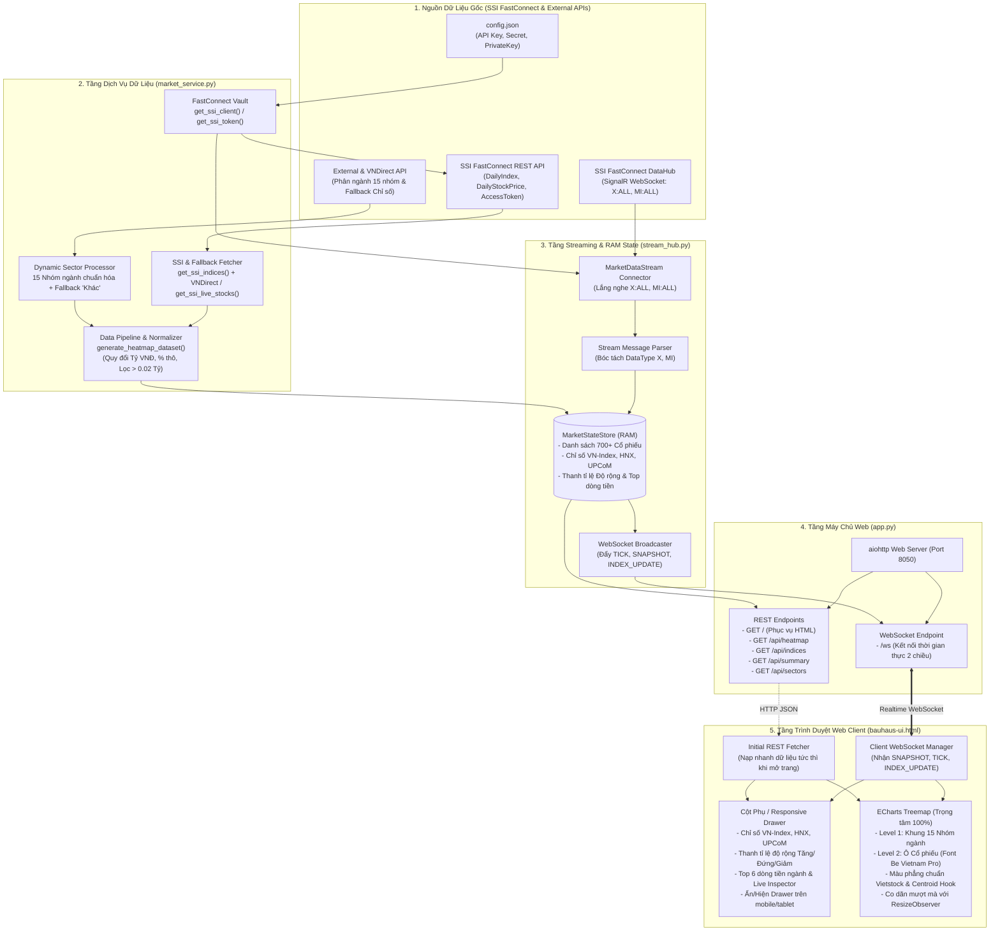

# TÀI LIỆU KIẾN TRÚC & HỆ THỐNG BẢN ĐỒ THỊ TRƯỜNG CHỨNG KHOÁN (HEATMAP STOCKS)

---

## 1. TỔNG QUAN HỆ THỐNG & ĐẶC TẢ KỸ THUẬT

Hệ thống **Heatmap Stocks** là nền tảng phân tích và trực quan hóa bản đồ nhiệt thị trường chứng khoán Việt Nam theo thời gian thực (Real-time Market Heatmap), được xây dựng theo chuẩn mực thiết kế tài chính chuyên nghiệp (Bloomberg / Vietstock / Finviz).

### ✨ Các đặc tính nổi bật:
1. **100% Dữ liệu động thực tế từ SSI FastConnect**:
   - Điểm số và % biến động của các chỉ số: **VN-Index, VN30, HNX-Index, HNX30, UPCOM-Index**.
   - Dữ liệu giá khớp lệnh, giá tham chiếu, giá trần/sàn, khối lượng và giá trị giao dịch của hơn **469+ cổ phiếu đạt chuẩn**.
2. **Bộ điều khiển hình học độc quyền (Geometry-Driven Typography Engine)**:
   - Can thiệp trực tiếp vào nhân đồ họa **ZRender của Apache ECharts** (`Rect.prototype.setTextContent`).
   - Tên mã và % biến động được **căn giữa tuyệt đối tại trọng tâm (Centroid)** của từng ô chữ nhật.
   - Tự động co giãn kích thước chữ theo tỷ lệ diện tích ô thực tế ($W \times H$), không dùng ngưỡng thanh khoản thô cứng để lọc chữ.
   - Tự động ẩn chữ ở các ô siêu nhỏ ($W < 38\text{px}$ hoặc $H < 24\text{px}$) để triệt tiêu hoàn toàn hiện tượng tràn viền hoặc ký tự cắt cụt `...`.
3. **Cơ chế Streaming Thời Gian Thực (SignalR & WebSockets)**:
   - Kết nối song song tới cổng SignalR `fc-datahub.ssi.com.vn` (kênh `X:ALL`, `MI:ALL`).
   - Phân phối tick giá tới trình duyệt qua kết nối WebSocket `/ws` với độ trễ dưới $50\text{ms}$.
   - Hiệu ứng nhấp nháy đổi màu (`.flash-update`) tức thì khi có biến động giá.
4. **Giải thuật xử lý Ngày nghỉ & Cuối tuần (Sliding 10-Day Window Fallback)**:
   - Tự động quét lùi 10 ngày để lấy phiên giao dịch gần nhất khi hệ thống khởi động ngoài giờ hoặc vào ngày nghỉ, đảm bảo dữ liệu luôn đầy đủ.

---

## 2. CẤU TRÚC THƯ MỤC DỰ ÁN (PROJECT STRUCTURE)

```
Heatmap Stocks/
├── app.py                      # Máy chủ web aiohttp, REST APIs, WebSocket Hub & Điều phối hệ thống
├── market_service.py           # Dịch vụ dữ liệu SSI FastConnect REST API, Token Vault, Phân ngành ICB
├── stream_hub.py               # SignalR Streaming Client, Lưu trữ RAM State (MarketStateStore)
├── config.json                 # Thông tin khóa API (Consumer ID, Consumer Secret, Private Key)
├── bauhaus-ui.html             # Giao diện SPA chuẩn Dark Theme tích hợp ECharts Treemap Engine
├── cache/                      # Thư mục lưu cache cục bộ (SSI Access Token, Metadata Ngành nghề)
│   ├── ssi_token_cache.json
│   └── stocks_cache.json
├── assets/                     # Các file định dạng phong cách giao diện bổ trợ (CSS/JS)
│   ├── bauhaus.css
│   ├── animations.css
│   └── custom_animation.js
└── DOCS.md                     # Tài liệu kiến trúc toàn diện của hệ thống
```

---

## 3. GIẢI THÍCH CHI TIẾT CÁC CODE REGION Ở TỪNG FILE

### 📂 File 1: `market_service.py` (Tầng Dịch vụ Dữ liệu & Xử lý Thị trường)

| Region | Tên Region | Vai trò & Chức năng kỹ thuật |
| :--- | :--- | :--- |
| **`# region 1`** | **Imports & Configuration** | Nạp các thư viện `pandas`, `requests`, `ssi_fc_data.model`, `MarketDataClient`, cấu hình thư mục lưu cache `/cache`, đọc file `config.json` và thiết lập các URL máy chủ SSI FastConnect. |
| **`# region 2`** | **Authentication & FastConnect Vault** | Quản lý phiên xác thực, tự động khởi tạo và lưu giữ đối tượng `MarketDataClient` singleton cùng AccessToken của SSI để tái sử dụng xuyên suốt phiên làm việc. |
| **`# region 3`** | **Dynamic Sector Processing** | Tự động kết nối API phân ngành chứng khoán để lấy ngành nghề chuẩn ICB của hơn 3,000 mã cổ phiếu; có sẵn tầng lưu cache cục bộ và cơ chế tự động gán vào nhóm `"Khác"` nếu gặp mã mới chưa phân loại. |
| **`# region 4`** | **SSI Market Data & Indices Fetcher** | Gọi trực tiếp API SSI FastConnect: `get_ssi_indices()` lấy chuẩn xác điểm số, % thay đổi và số mã Tăng/Giảm của các chỉ số; `get_ssi_live_stocks()` lấy toàn bộ giá khớp, giá tham chiếu và thanh khoản kèm thuật toán lùi ngày khi nghỉ lễ. |
| **`# region 5`** | **Data Pipeline & Heatmap Dataset Generator** | Pipeline chuẩn hóa dữ liệu: tính toán diện tích theo tỷ đồng (`traded_value = raw_val / 1,000,000,000`), tính % biến động thô từ giá khớp và giá tham chiếu, áp dụng bộ lọc thanh khoản $> 0.02$ tỷ đồng. |
| **`# region 6`** | **UI Controllers & Summary Accessors** | Cung cấp các hàm tiền xử lý phục vụ các API REST: lọc theo sàn, lọc theo ngành, tìm kiếm mã, sắp xếp danh sách và lấy tóm tắt thị trường. |

---

### 📂 File 2: `stream_hub.py` (Tầng Streaming Real-time & Quản lý Trạng thái RAM)

| Region | Tên Region | Vai trò & Chức năng kỹ thuật |
| :--- | :--- | :--- |
| **`# region 1`** | **Imports & Configuration** | Nạp các module đa luồng `threading`, `asyncio` và kết nối với các hàm dịch vụ từ `market_service`. |
| **`# region 2`** | **Real-time In-memory Store** | Lớp `MarketStateStore`: Lưu trữ toàn bộ dữ liệu 469+ cổ phiếu và chỉ số thị trường trực tiếp trong bộ nhớ RAM, đảm bảo thread-safe (an toàn đa luồng) với `threading.Lock()`. |
| **`# region 3`** | **FastConnect WebSocket Stream Connector** | Lớp `StreamHub`: Khởi chạy luồng kết nối WebSocket SignalR tới máy chủ `https://fc-datahub.ssi.com.vn` (kênh `X:ALL`, `B:ALL`, `MI:ALL`), đồng thời duy trì luồng đồng bộ dữ liệu định kỳ. |
| **`# region 4`** | **Stream Message Parser & Data Validation** | Bộ bóc tách thông điệp stream: Giải mã các gói tin `MI` (Chỉ số), `X` (Khớp lệnh realtime), tính toán lại % biến động và cập nhật trạng thái mới nhất vào RAM. |
| **`# region 5`** | **Client WebSocket Hub & Broadcasting** | Quản lý danh sách các trình duyệt Web đang kết nối và phát sóng (`broadcast`) tức thì dữ liệu `SNAPSHOT`, `TICK` và `INDEX_UPDATE` tới người dùng. |

---

### 📂 File 3: `app.py` (Tầng Web Server & Điều phối Hệ thống)

| Region | Tên Region | Vai trò & Chức năng kỹ thuật |
| :--- | :--- | :--- |
| **`# region 1`** | **Imports & Initialization** | Khởi tạo framework `aiohttp.web`, nạp cấu hình đường dẫn file HTML và thư mục tĩnh `assets`. |
| **`# region 2`** | **CORS Middleware & Security Headers** | Middleware thiết lập đầy đủ CORS headers (`Access-Control-Allow-Origin: *`), cho phép giao tiếp API và WebSocket thông suốt. |
| **`# region 3`** | **Web Server Setup & REST Endpoints** | Thiết lập các đường dẫn REST API: `/` (phục vụ file HTML), `/api/heatmap`, `/api/summary`, `/api/indices`, `/api/sectors`. |
| **`# region 4`** | **WebSocket Real-time Endpoint** | Xử lý route `/ws`: Bắt tay kết nối WebSocket với trình duyệt, lập tức gửi gói dữ liệu ban đầu `SNAPSHOT` và duy trì phản hồi lệnh `PING`/`GET_SNAPSHOT`. |
| **`# region 5`** | **Lifecycle & Stream Hub Bootstrapper** | Quản lý sự kiện khởi động server `on_startup` (gắn event loop và bật StreamHub) và sự kiện tắt server an toàn `on_cleanup`. |
| **`# region 6`** | **Main Execution & Auto-Browser** | Điểm khởi chạy ứng dụng tại địa chỉ `http://127.0.0.1:8050` và kích hoạt tự động mở trình duyệt. |

---

### 📂 File 4: `bauhaus-ui.html` (Tầng Giao diện Người dùng & Engine ECharts)

| Region | Tên Region | Vai trò & Chức năng kỹ thuật |
| :--- | :--- | :--- |
| **`# Region [1]`** | **Design System Tokens & Dark Theme** | Khởi tạo bảng màu tài chính tương phản cao chuẩn Vietstock: Tím trần (`#a855f7`), Xanh tăng (`#00c073`), Vàng TC (`#facc15`), Đỏ giảm (`#ef4444`), Xanh lơ sàn (`#06b6d4`). |
| **`# Region [2]`** | **Header & Navigation Bar** | Thanh công cụ: Các nút chọn sàn (Tất cả / HOSE / HNX / UPCOM), menu lọc ngành (sắp xếp theo thanh khoản, `Khác` ở đáy cùng), tiêu chí diện tích (GTGD / KLGD), tìm kiếm mã và đèn trạng thái stream. |
| **`# Region [3]`** | **Main Responsive Layout** | Cột trái / Drawer phụ (Thẻ 3 chỉ số thị trường, Thanh tỉ lệ độ rộng Tăng/Đứng/Giảm, Top 6 dòng tiền ngành, Khối chi tiết mã Live Inspector; tự thu gọn thành Drawer trên mobile/tablet hoặc qua nút Toggle) và Cột phải (Bản đồ nhiệt ECharts Treemap 100% trọng tâm). |
| **`# Region [4]`** | **Footer & Market Color Legend** | Chân trang hiển thị số lượng mã theo 5 màu thị trường (Trần, Tăng, Đứng giá, Giảm, Sàn) và đồng hồ cập nhật. |
| **`# Region [5]`** | **Libraries & ECharts Engine Patch** | Nạp ECharts 5.4.3 CDN và kích hoạt **Geometry-Driven ZRender Hook** (`echarts.graphic.Rect.prototype.setTextContent`) để đo toạ độ pixel $W \times H$, căn giữa văn bản và chống tràn chữ. |
| **`# Region [6]`** | **Real-time WebSocket Client** | Duy trì kết nối WebSocket Client `/ws`, tự động kết nối lại khi mất mạng, xử lý cập nhật dữ liệu và hàm `formatPct` định dạng `#.#%` / `+#.##%` / `+0%`. |
| **`# Region [7]`** | **Market UI Controller & Interaction Handlers** | Khởi tạo Treemap ECharts đa tầng, vẽ các ô cổ phiếu căn giữa bên trong từng khối ngành, hỗ trợ nhấp chọn mã xem chi tiết, nhấp vào ngành để Zoom chi tiết, và phím `Esc` để quay lại toàn cảnh tức thời ($0\text{ms}$). |

---

## 4. SƠ ĐỒ KIẾN TRÚC & LUỒNG KẾT NỐI DỮ LIỆU (SYSTEM ARCHITECTURE MAP)



---

## 5. BỘ ĐIỀU KHIỂN HÌNH HỌC & QUY TẮC HIỂN THỊ CHỮ (TYPOGRAPHY ENGINE)

Để giải quyết triệt để lỗi căn lệch dòng và tràn viền chữ trong Apache ECharts, hệ thống tích hợp bộ Hook trực tiếp vào nhân ZRender:

### Bảng phân bổ kích thước chữ theo diện tích ô thực tế ($W \times H$):

| Kích thước ô thực tế trên màn hình | Quyết định hiển thị chữ | Kích thước Font Mã CP | Kích thước Font % Biến động |
| :--- | :--- | :--- | :--- |
| **Ô rất to** ($W \ge 130\text{px}, H \ge 75\text{px}$) | ✅ Hiển thị đầy đủ | **`20px`** (Black 900) | **`14px`** (Bold 800) |
| **Ô to vừa** ($W \ge 80\text{px}, H \ge 48\text{px}$) | ✅ Hiển thị đầy đủ | **`15px`** (Black 900) | **`12px`** (Bold 800) |
| **Ô trung bình** ($W \ge 52\text{px}, H \ge 32\text{px}$) | ✅ Hiển thị đầy đủ | **`12px`** (Bold 800) | **`10px`** (Bold 700) |
| **Ô nhỏ gọn** ($W \ge 38\text{px}, H \ge 24\text{px}$) | ✅ Hiển thị đầy đủ | **`9.5px`** (Bold 800) | **`8px`** (Bold 700) |
| **Ô siêu nhỏ** ($W < 38\text{px}$ hoặc $H < 24\text{px}$) | ⛔ Tự động ẩn chữ | *Không hiện chữ để tránh tràn viền, chỉ để ô màu phẳng* |

---

## 6. HƯỚNG DẪN KHỞI CHẠY & VẬN HÀNH (QUICKSTART)

### 1. Cài đặt môi trường & Thư viện phụ thuộc
```bash
pip install -r requirements.txt
# hoặc cài trực tiếp:
pip install aiohttp pandas requests ssi-fc-data
```

### 2. Cấu hình thông tin xác thực SSI FastConnect
Chỉnh sửa file `config.json` với thông tin được cấp từ SSI:
```json
{
  "consumerID": "YOUR_CONSUMER_ID",
  "consumerSecret": "YOUR_CONSUMER_SECRET",
  "privateKey": "YOUR_PRIVATE_KEY_CONTENT"
}
```

### 3. Khởi chạy hệ thống
```bash
python3 app.py
```
- Server sẽ khởi động tại: **`http://127.0.0.1:8050`**
- Trình duyệt mặc định sẽ tự động mở trang web hiển thị Bản đồ thị trường trực quan theo thời gian thực.


